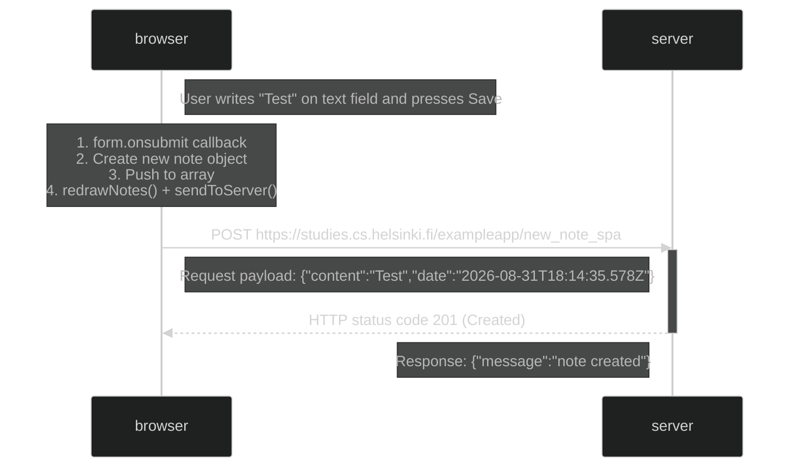

```mermaid
%%{init: {'theme': 'dark'}}%%
sequenceDiagram
    participant browser
    participant server

    Note right of browser: User writes "Test" on text field and presses Save

    Note over browser: 1. form.onsubmit callback<br/>2. Create new note object<br/>3. Push to array<br/>4. redrawNotes() + sendToServer()

    browser->>server: POST https://studies.cs.helsinki.fi/exampleapp/new_note_spa
    activate server
    Note right of browser: Request payload: {"content":"Test","date":"2026-08-31T18:14:35.578Z"}
    server-->>browser: HTTP status code 201 (Created)
    deactivate server
    Note left of server: Response: {"message":"note created"}
```